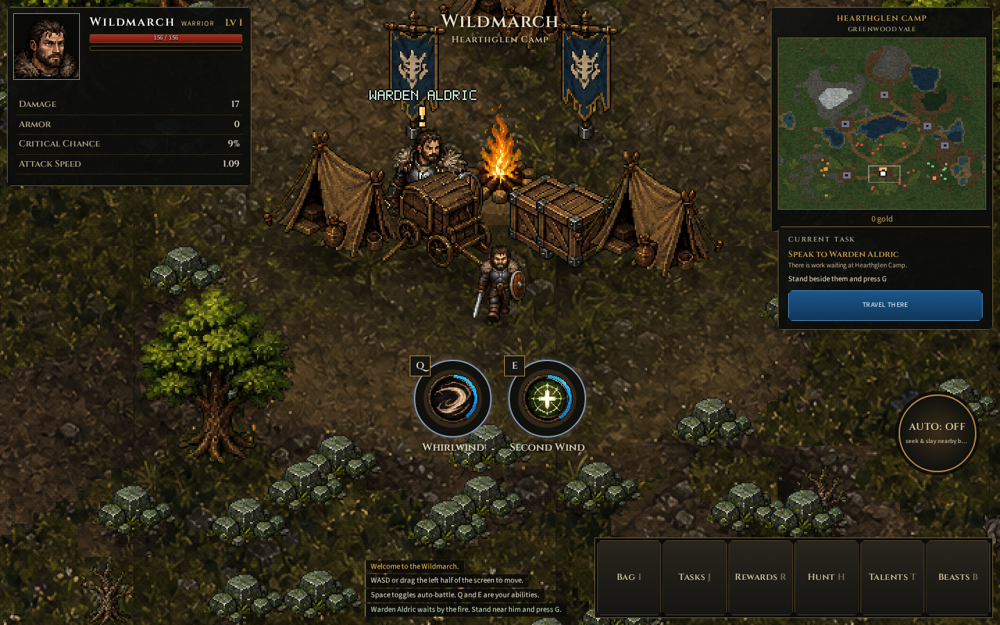
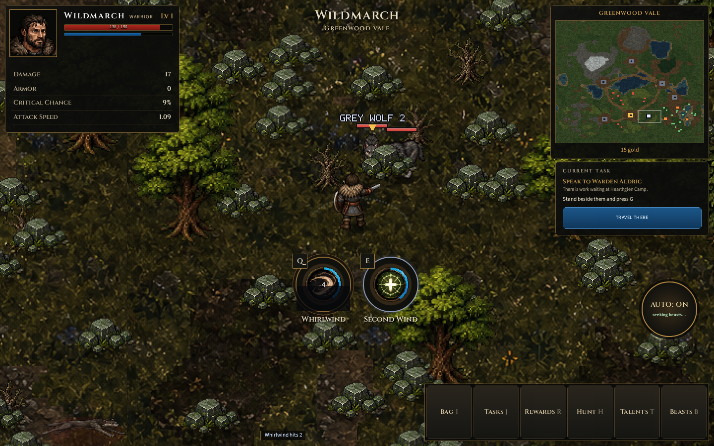
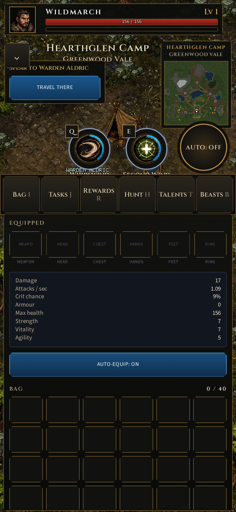
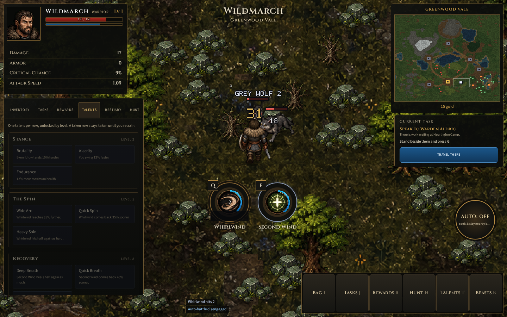

# Wildmarch

A vertical slice of an idle action RPG with a top-down view. It runs in a
browser, it draws to a canvas, and it keeps your character on your own machine.



## What it is

You play one Warrior in a seeded world of six regions. Auto-battle hunts for
you, so the game carries on whether you drive it or watch it. It pays you for
the time you are away with a ledger that steps through your absence in slices
and works out what you would have killed.

- **Six regions**, from Greenwood Vale out to the apex grounds, each with its
  own level band and its own dens.
- **Five species** with four behaviours: a wolf stalks, a boar charges, a
  spider webs, and rooks flock and scatter.
- **A chain of tasks**, given by people who stand in the camps and wait for you
  to speak to them.
- **Relics, talents and beast mastery**, which all fold into one bag of
  modifiers, so the live game and the offline ledger always agree.
- **World bosses on a wall clock**, not on a respawn timer, so every client
  agrees about when an apex beast walks.



## Run it

```bash
npm install
npm run dev        # http://localhost:5173, open to the LAN and to mobile
```

Other commands:

```bash
npm run verify     # typecheck, lint, unit tests, build, browser tests
npm test           # vitest
npm run build      # a production bundle in dist/
```

The game reads WASD or the left half of the screen. Space toggles auto-battle,
Q and E are your abilities, and G speaks to the person beside you.

## It plays on a phone

The HUD collapses, the abilities grow, and the lower left of the screen becomes
a thumbstick.



## How it is built

No runtime dependencies except two fonts. TypeScript, Vite, and a canvas.

```
src/
  main.ts        the frame loop
  core/          maths, seeded noise, input
  game/          the simulation, all tuning, the save schema, the offline ledger
  render/        the pixel pipeline, terrain, sprites, the bitmap font
  ui/            the HUD overlay and the only file that knows about localStorage
tools/           the art pipelines
art/             the source art the pipelines compose from
```

The simulation never touches the DOM. The renderer only draws to the canvas.
One channel joins them, and one file knows about storage, because the save
schema has to survive a move to a server.



### The art pipeline

Every sprite is composed from generated art by the tools in `tools/`. The rule
that matters: **never divide an atlas, measure it.** Art from an image model
does not sit on a grid that divides evenly, and no prompt makes it. One run
that was asked for evenly spaced frames came back at 483, 486 and 486 px.

`tools/art/` builds a character sheet with 8 facings, one row for each, so
nothing is ever mirrored — a mirror puts a sword in the wrong hand.
`tools/art/README.md` describes the steps and the traps.

`CLAUDE.md` holds the rules that the code depends on and the reason behind each
one. Read it before you change the frame loop, the pixel pipeline, or anything
that decides when a beast stops a chase.

## State

A prototype. The world, the loop, the loot, the tasks and the ledger all work
end to end. The art is at prototype fidelity: the warrior and the wolf have
full 8-facing sheets, and the other four species still use a single side view
until their sheets are built.
